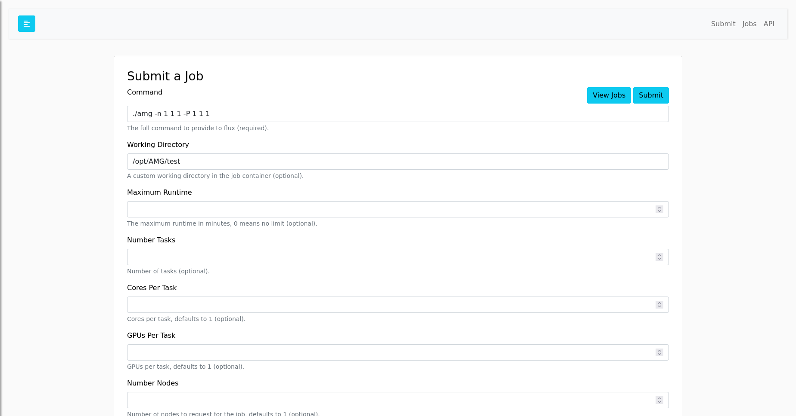

# Flux AMG Example

This is an example container where you can build (optional) and run:

```bash
$ docker build -t amg .
```

or with a tag for the restful API:

```bash
$ docker build --no-cache --build-arg app="latest" -t amg .
$ docker run -it -p 5000:5000 amg
```

Requiring a Flux user/token (fluxuser and 12345)

```bash
$ docker run -it --env require_auth=true -p 5000:5000 amg
```

And then enter the fluxuser and 123456 as the user and token, and try submitting a job to
the examples like:

```console
# Potential command and workdir
# amg -n %SIZE% %SIZE% %SIZE% -P %SIZE% %SIZE% %SIZE%" 
# command: ./amg -n 1 1 1 -P 1 1 1
# workdir: /opt/AMG/test
```


And then browse to the table and click on the ID to see the log.



You can also try using the [RESTFul API](https://flux-framework.org/flux-restful-api/getting_started/user-guide.html#getting-started-user-guide--page-root). Have fun!
