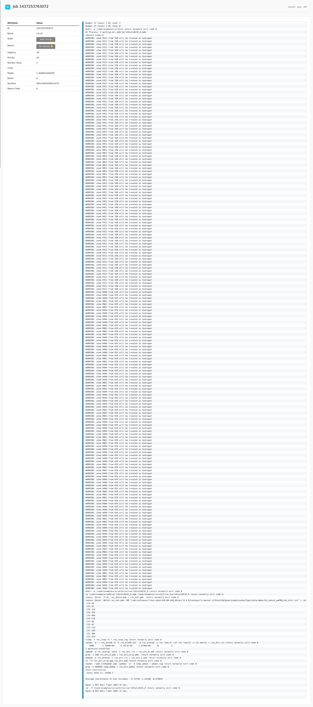

# Conveyorlc + Spack

```bash
$ docker build -t clc .
```

If you want to test the benchmarks without the UI, shell inside 🐚️:

```bash
docker run -it --entrypoint bash clc
```

Activate the spack environment:

```bash
cd /opt/spack-environment
. /opt/spack-environment/spack/share/spack/setup-env.sh
spack env activate .
```

Now flux should be on the path. Now start a mini cluster:

```bash
flux start --test-size=4
```

Sanity check for flux mini run:

```bash
$ flux mini run echo hello
hello
```

As a sanity check, you should have spack on your path, and the view provided by the environment.
You should be able to find these executables:

```bash
# ambertools
$ which sander 

# conveyorlc
$ which CDT1Receptor
```
And of course we already started flux (also installed in the spack environment)
Next, let's run the example! Go to `/code/examples`, the root
where you want to run them from. 

```bash
cd /code/examples
```
and then export some paths.

```bash
export CONVEYORLCHOME=$(spack find --format "{prefix}" conveyorlc)
export LBindData=$CONVEYORLCHOME/data
export AMBERHOME=/opt/conda
```

And now we are ready to run with flux! The `-n 2` for processes and option for mpi is important - it won't work without them.
Also note that if you have a "scratch" in your examples folder you should remove it entirely first.

```bash
cd /code/examples
rm -rf ./scratch
flux mini run -n 2 -ompi=openmpi@5 CDT1Receptor --input  pdb.list --output out --version 16 --spacing 1.4 --minimize on --forceRedo on
```

If all is well, you should see the start of the run look like this:

```bash
WARNING: atom HNAI from HID will be treated as hydrogen
WARNING: atom HNAI from HID will be treated as hydrogen
WARNING: atom HAHA from HID will be treated as hydrogen
WARNING: atom HAHA from HID will be treated as hydrogen
WARNING: atom HAHA from HID will be treated as hydrogen
mkdir -p /code/examples/scratch/rec/sarinXtalnAChE_A return normally exit code 0
cp /code/examples/pdb/sarinXtalnAChE_A.pdb /code/examples/scratch/rec/sarinXtalnAChE_A return normally exit code 0
reduce -Quiet -Trim  rec_AForm.pdb > rec_noh.pdb  return normally exit code 0
reduce -Quiet -BUILD rec_noh.pdb -DB "/opt/software/linux-ubuntu20.04-x86_64/gcc-9.4.0/conveyorlc-master-sl5hzatz6k3qsqcjxsmyktsudou7tges/data/amber16_reduce_wwPDB_het_dict.txt" > rec_rd.pdb return normally exit code 1
 CYX 66
 CYX 93
 CYX 254
 CYX 269
 CYX 406
 CYX 526
 CYS 66
 CYS 93
 CYS 254
 CYS 269
 CYS 406
 CYS 526
...
```

This will take 45-60 minutes on Linux, and up to a day on a Mac. Yes, we don't like Macs and containers.
If you want to test with the UI:

```bash
$ docker run -it -p 5000:5000 clc
```

The login should be `fluxuser` and "12345".
In the job submit interface, specify the correct command and working directory. Note that since we need
to source spack and export some envars, we provide a script [run.sh](scripts/run.sh) instead of the
command alone.


```
# workdir: /code/scripts
# command: ./run.sh
# number of tasks: 2
```

This command takes a lot of resources so (for me) I couldn't load the UI after that,
but I could shell into the running container to see the CPU with top and that the script
was running. After about 45 minutes when I saw those go away I could then refresh and see the interface
(and output results):


