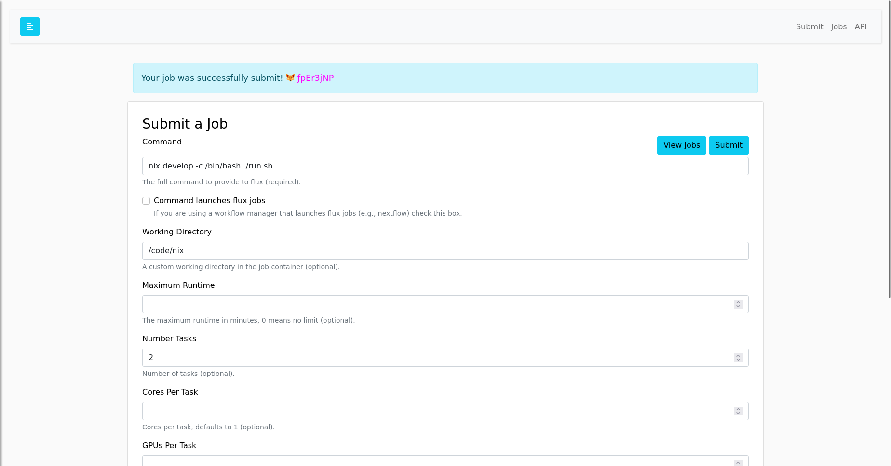
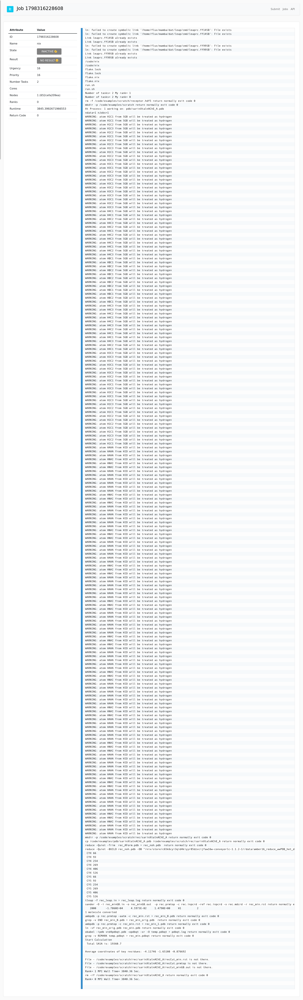

# Conveyorlc


```bash
$ docker build -t clc .
```

If you want to test the benchmarks without the UI:

```bash
docker run -it --entrypoint bash clc
```

Make sure flux is on the path (if not, source the environment)

```bash
. /etc/profile.d/z10_spack_environment.sh
flux start --test-size=4
```

And now activate conveyorlc with nix (workdir should be `/code/nix`)

```bash
cd /code/nix
nix develop
```

Now let's prepare the environment for an example.

```bash
# Note this will need to be changed when conveyorlc is updated
export CONVEYORLCHOME=/nix/store/c65k6cyi3qid4kiyyr85dzvcijfaw16w-conveyorlc-1.1.2-1/
export LBindData=$CONVEYORLCHOME/data
export PATH=$CONVEYORLCHOME/bin:/nix/store/g36nfns6bm8gqwabxqv4d3w8z043x71g-openbabel-2.4.1/bin:$PATH
export AMBERHOME=/home/fluxuser/mamba/
export PATH=$AMBERHOME/bin/:$PATH
```

Make sure the spack PYTHONPATH is merged with Nix:

```bash
export PYTHONPATH=$PYTHONPATH:/opt/view/lib/python3.10/site-packages:/opt/software/linux-ubuntu20.04-x86_64/gcc-9.4.0/py-pyrsistent-0.18.1-4y45yicct333hekudm6spwmfo4zurvir/lib/python3.10/site-packages:/opt/software/linux-ubuntu20.04-x86_64/gcc-9.4.0/py-attrs-22.1.0-6l7qhin5aaqyev56skpsvruxox2ywn3s/lib/python3.10/site-packages:/opt/software/linux-ubuntu20.04-x86_64/gcc-9.4.0/py-pycparser-2.21-7seqp6a5ivvr4t3xygon2ttiyh55bbm6/lib/python3.10/site-packages:/opt/software/linux-ubuntu20.04-x86_64/gcc-9.4.0/py-pyyaml-6.0-ayf2ig4btgiev7ir675l7oywhvgl7rhs/lib/python3.10/site-packages:/opt/software/linux-ubuntu20.04-x86_64/gcc-9.4.0/py-jsonschema-4.16.0-6zl5yjunrcsn4zpywynn5oph32iqlvou/lib/python3.10/site-packages:/opt/software/linux-ubuntu20.04-x86_64/gcc-9.4.0/py-cffi-1.15.0-gyk2my27jc3b5gno4zcqtm3riumyl4vp/lib/python3.10/site-packages;
```

Sanity check for flux mini run:

```bash
$ flux mini run echo hello
hello
```

and then to run with Flux:

```bash
cd /code/examples
flux mini run -ompi=openmpi@5 -n 2 CDT1Receptor --input  pdb.list --output out --version 16 --spacing 1.4 --minimize on --forceRedo on
```

If you want to test with the UI:

```bash
$ docker run -it -p 5000:5000 clc
```

The login should be `fluxuser` and "12345".
In the job submit interface, specify the correct command and working directory:



```
# workdir: /code/nix
# command: nix develop -c /bin/bash ./run.sh
# number of tasks: 2
```

This command takes a lot of resources so (for me) I couldn't load the UI after that,
but I could shell into the running container to see the CPU with top and that the script
was running. After about 45 minutes when I saw those go away I could then refresh and see the interface
(and output results):



