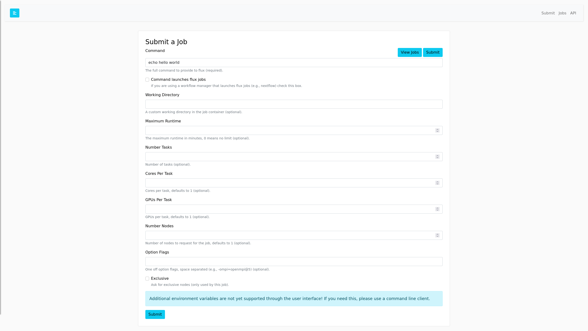
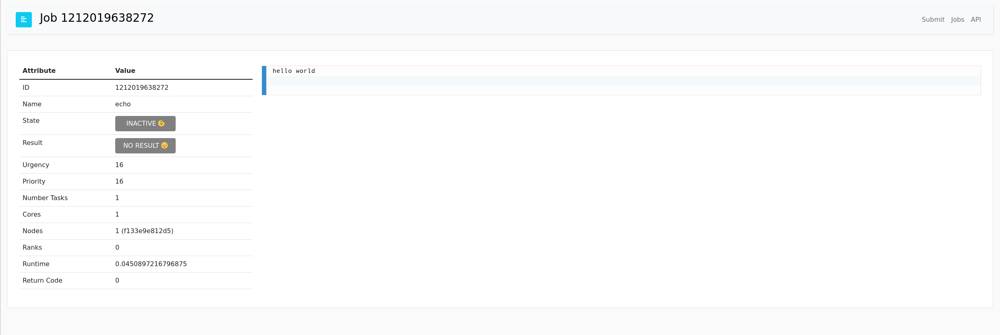

# Hello World

The most basic examplet o run hello world with flux!

```bash
$ docker build -t hello-world .
```

And run:

```bash
$ docker run -it -p 5000:5000 hello-world
```

The login should be `fluxuser` and "12345".
In the job submit interface, echo hello world:

```
echo hello world
```



And then browse to the table and click on the ID to see the log.



