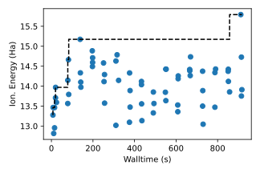

# Molecular Design with Parsl + Flux

This example workflow will walk you through running the 
the [EXAWorks Molecular Design Demo](https://github.com/ExaWorks/molecular-design-parsl-demo)
using Parsl and Flux. We have adopted the first script to be run from the command line instead
of notebooks. Also, the columna integration does not seem to work, so we only
provide the first workflow as an example. First, build the container:

```bash
$ docker build -t mdparsl .
```

And shell inside:

```bash
$ docker run -it --rm --name mdparsl mdparsl
```

You'll need to be inside a Flux instance:

```bash
$ flux start --test-size=4
```

And activate the conda environment. Note that flux is actually installed alongside mamba!

```bash
$ conda activate /opt/conda/envs/moldesign-demo/
```

## 0. Molecular Design

And then check out the usage of the script:
```bash
python3 ./scripts/0_molecular-design-with-parsl.py --help
```
```console
usage: 0_molecular-design-with-parsl.py [-h] [--workers WORKERS] [--outdir OUTDIR] [--working-dir WORKING_DIR] [--search-space SEARCH_SPACE]
                                        [--initial-count INITIAL_COUNT] [--search-count SEARCH_COUNT] [--batch-size BATCH_SIZE]
                                        [--flux-workers FLUX_WORKERS]

optional arguments:
  -h, --help            show this help message and exit
  --workers WORKERS     Number of workers (defaults to cpu count)
  --outdir OUTDIR       Output directory (defaults PWD if not defined)
  --working-dir WORKING_DIR
                        Working directory for Flux (defaults to PWD)
  --search-space SEARCH_SPACE
                        search space of molecules (selected randomly from the QM9 database)
  --initial-count INITIAL_COUNT
                        Number of calculations to run at first
  --search-count SEARCH_COUNT
                        Number of molecules to evaluate in total
  --batch-size BATCH_SIZE
                        Number of molecules to evaluate in each batch of simulations
  --flux-workers FLUX_WORKERS
                        Number of flux node available to run
```

For now you can use the defaults. This script will use Flux internally (no need to run with flux submit, etc.)

```bash
$ python3 ./scripts/0_molecular-design-with-parsl.py
```

Then to copy over data from your host:

```bash
$ mkdir -p ./data && cd ./data
$ docker cp mdparsl:/workflow/training-data-vs-time.svg .
$ docker cp mdparsl:/workflow/parsl-results.csv .
```

Check out the results of this run under [data](data):



And this is created from `parsl-results.csv`.
Before you exit the container, notice in the working directory there are a ton of output pickle and text files,
and a "runinfo" directory. There might be more data here you are interested in. You can also look at the various
shell scripts created to run jobs, e.g.,

<details>

<summary>cat parsl.localprovider.1678976440.9403515.sh</summary>

```bash
export JOBNAME=$parsl.localprovider.1678976440.9403515
set -e
export CORES=$(getconf _NPROCESSORS_ONLN)
[[ "1" == "1" ]] && echo "Found cores : $CORES"
WORKERCOUNT=1
FAILONANY=0
PIDS=""

CMD() {
/usr/bin/flux start /opt/conda/envs/moldesign-demo/bin/python3 /opt/conda/envs/moldesign-demo/lib/python3.9/site-packages/parsl/executors/flux/flux_instance_manager.py tcp e25b3d4a9787 45085
}
for COUNT in $(seq 1 1 $WORKERCOUNT); do
    [[ "1" == "1" ]] && echo "Launching worker: $COUNT"
    CMD $COUNT &
    PIDS="$PIDS $!"
done

ALLFAILED=1
ANYFAILED=0
for PID in $PIDS ; do
    wait $PID
    if [ "$?" != "0" ]; then
        ANYFAILED=1
    else
        ALLFAILED=0
    fi
done

[[ "1" == "1" ]] && echo "All workers done"
if [ "$FAILONANY" == "1" ]; then
    exit $ANYFAILED
else
    exit $ALLFAILED
fi
(moldesign-demo) root@e25b3d4a9787:/workflow# cat parsl.localprovider.1678976440.9403515.sh

export JOBNAME=$parsl.localprovider.1678976440.9403515
set -e
export CORES=$(getconf _NPROCESSORS_ONLN)
[[ "1" == "1" ]] && echo "Found cores : $CORES"
WORKERCOUNT=1
FAILONANY=0
PIDS=""

CMD() {
/usr/bin/flux start /opt/conda/envs/moldesign-demo/bin/python3 /opt/conda/envs/moldesign-demo/lib/python3.9/site-packages/parsl/executors/flux/flux_instance_manager.py tcp e25b3d4a9787 45085
}
for COUNT in $(seq 1 1 $WORKERCOUNT); do
    [[ "1" == "1" ]] && echo "Launching worker: $COUNT"
    CMD $COUNT &
    PIDS="$PIDS $!"
done

ALLFAILED=1
ANYFAILED=0
for PID in $PIDS ; do
    wait $PID
    if [ "$?" != "0" ]; then
        ANYFAILED=1
    else
        ALLFAILED=0
    fi
done

[[ "1" == "1" ]] && echo "All workers done"
if [ "$FAILONANY" == "1" ]; then
    exit $ANYFAILED
else
    exit $ALLFAILED
fi
```

</details>

The other steps don't work - we have "best effort" scripts that (should?) work but we never got columna to work 
(it hangs).
