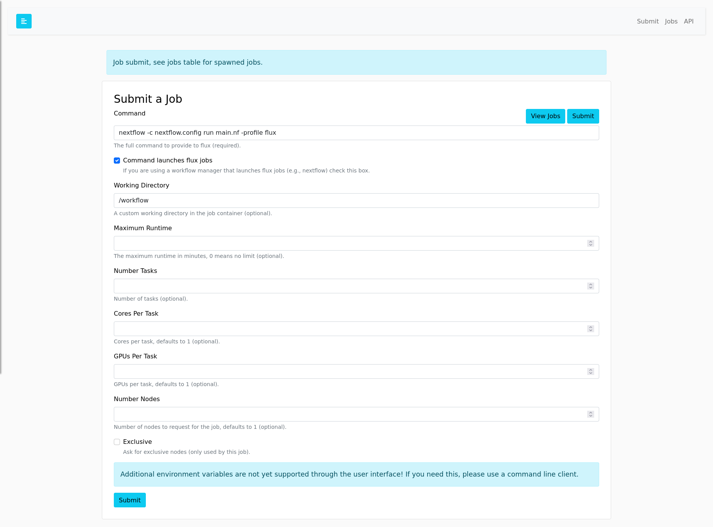
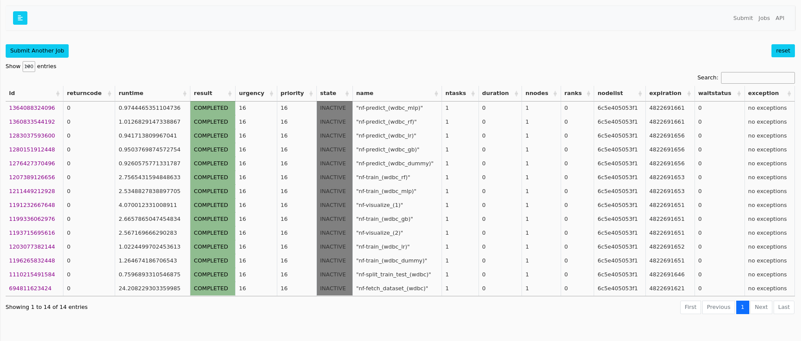

# Flux Nextflow Example

This is an example container where you can build (optional) and run
the [Nextflow Machine Learning](https://github.com/nextflow-io/ml-hyperopt) tutorial:

```bash
$ docker build -t nextflow .
```

or with a tag for the restful API:

```bash
$ docker build --no-cache --build-arg app="latest" -t nextflow .
```

Note that we tweak the [nextflow.config](nextflow.config) so that it runs with
Flux. If you get an error, you likely can grab the [latest from the repository](https://github.com/nextflow-io/ml-hyperopt/blob/master/nextflow.config) and be sure to add a profile for Flux:

```
profiles {
...
    flux {
        process.executor = 'flux'
        process.conda = "$baseDir/conda.yml"
    }
```

## Running the Workflow

### RESTFul API and Interface

To use the Flux RESTFul API and interface:

```bash
$ docker run -it -p 5000:5000 nextflow
```

Requiring a Flux user/token (fluxuser and 12345)

```bash
$ docker run -it --env require_auth=true -p 5000:5000 nextflow
```

And then enter the fluxuser and 123456 as the user and token, and try submitting a job to
the examples like:

```console
# Potential command and workdir
# command: nextflow -c nextflow.config run main.nf -profile flux
# launcher (checked)
# workdir: /workflow
```

It's important to check that you are using a launcher (nextflow) that will be doing
the job submisson. Likely running the command with flux would work fine in a larger cluster
environment, but in our single container it would freeze.



You'll notice you don't get an ID back, but an instruction to look at the table.




The reason is because Nextflow has submit many flux jobs on our behalf!
Note that @vsoch is currently figuring out how to print logs to stdout, so
you won't see any output under each of the jobs (yet). You'll actually see the
high level output in the terminal, however:

```console
...
>  flux (14)
[3e/e2342b] process > fetch_dataset (wdbc)    [100%] 1 of 1 ✔
[67/fc202f] process > split_train_test (wdbc) [100%] 1 of 1 ✔
[c9/6cca01] process > visualize (2)           [100%] 2 of 2 ✔
[f9/bf911b] process > train (wdbc/mlp)        [100%] 5 of 5 ✔
[84/ba10a7] process > predict (wdbc/mlp)      [100%] 5 of 5 ✔
The best model for wdbc was rf, with r2 = 0.8922882819942839
```

You can also try using the [RESTFul API](https://flux-framework.org/flux-restful-api/getting_started/user-guide.html#getting-started-user-guide--page-root). Have fun!

### Manual

Or just shell into the container:

```bash
$ docker run -it --entrypoint bash nextflow
```

Activate the environment:

```bash
$ micromamba shell init --shell=bash --prefix=~/micromamba
$ source /root/.bashrc
$ eval $(micromamba shell hook --shell=bash)
$ micromamba activate nf
```

And then start the flux instance:

```bash
$ flux start --test-size=4
```

And go to the nextflow workflow, and run it with Flux!

```bash
$ cd /workflow
$ nextflow -c nextflow.config run main.nf -profile flux
```
That's it! 
