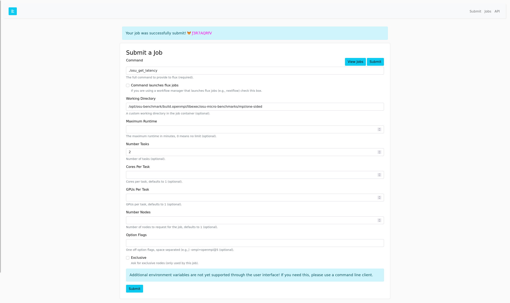
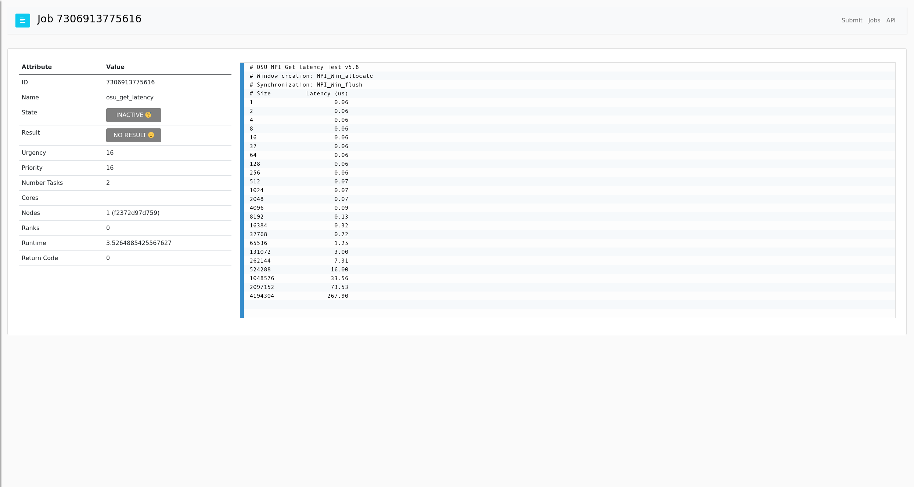

# OSU Benchmarks

Run the OSU Benchmarks

```bash
$ docker build -t osu-benchmarks .
```

If you want to test the benchmarks without the UI:

```bash
docker run -it --entrypoint bash osu-benchmarks
```
```bash
. /etc/profile.d/z10_spack_environment.sh
flux start --test-size=4
cd /opt/osu-benchmark/build.openmpi/libexec/osu-micro-benchmarks/mpi/one-sided
flux mini run -ompi=openmpi@5 -n 2 ./osu_get_latency
```

If you want to test with the UI:

```bash
$ docker run -it -p 5000:5000 osu-benchmarks
```

The login should be `fluxuser` and "12345".
In the job submit interface, specify the correct command and working directory:

```
# workdir: /opt/osu-benchmark/build.openmpi/libexec/osu-micro-benchmarks/mpi/one-sided
# command: ./osu_get_latency
# number of tasks: 2
```

Note that it's important to set the number of tasks (on the command line with flux
would be `-n 2` or `--ntasks 2` because this benchmark requires is!



And then browse to the table and click on the ID to see the log.



