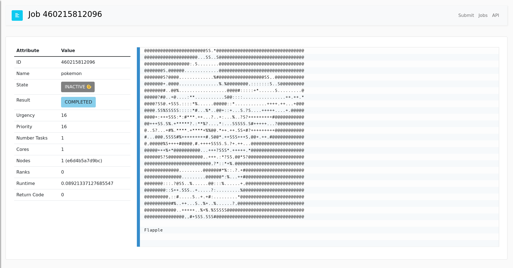

# Pokemon

Generate Pokemon with flux!

```bash
$ docker build -t pokemon .
```

And run:

```bash
$ docker run -it -p 5000:5000 pokemon
```

If you've added `FLUX_ENABLE_AUTH=true` the login should be `fluxuser` and "12345".
In the job submit interface, catch a pokemon!

```
pokemon --catch
```


And then browse to the table and click on the ID to see the log.



