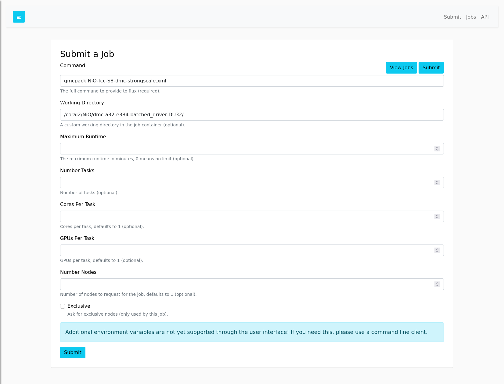
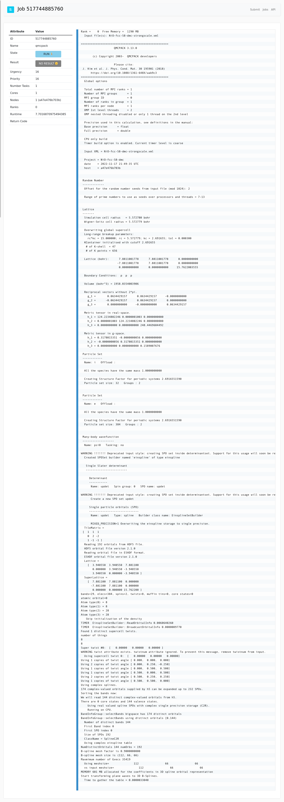

# Flux QMCPack Example

This is an example container where you can build (optional) and run:

```bash
$ docker build -t qmc .
```

or with a tag for the restful API:

```bash
$ docker build --no-cache --build-arg app="latest" -t qmc .
$ docker run -it -p 5000:5000 qmc
```

Note that this uses data generated with instructions in [data](data) that
is built into the container. If you want to start the container requiring a Flux user/token (fluxuser and 12345):

```bash
$ docker run -it --env require_auth=true -p 5000:5000 qmc
```

And then enter the fluxuser and 123456 as the user and token, and try submitting a job to
the examples like:

```console
# Potential command and workdir
# command: qmcpack NiO-fcc-S8-dmc-strongscale.xml
# workdir: /coral2/NiO/dmc-a32-e384-batched_driver-DU32/
```



And then browse to the table and click on the ID to see the log (here it is running):



You can also try using the [RESTFul API](https://flux-framework.org/flux-restful-api/getting_started/user-guide.html#getting-started-user-guide--page-root). Have fun!
