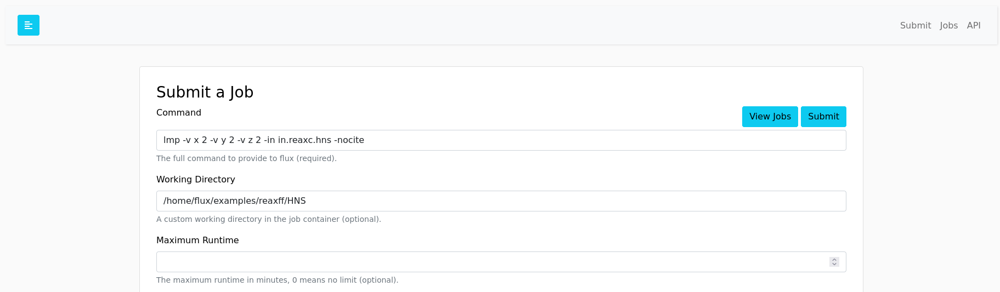
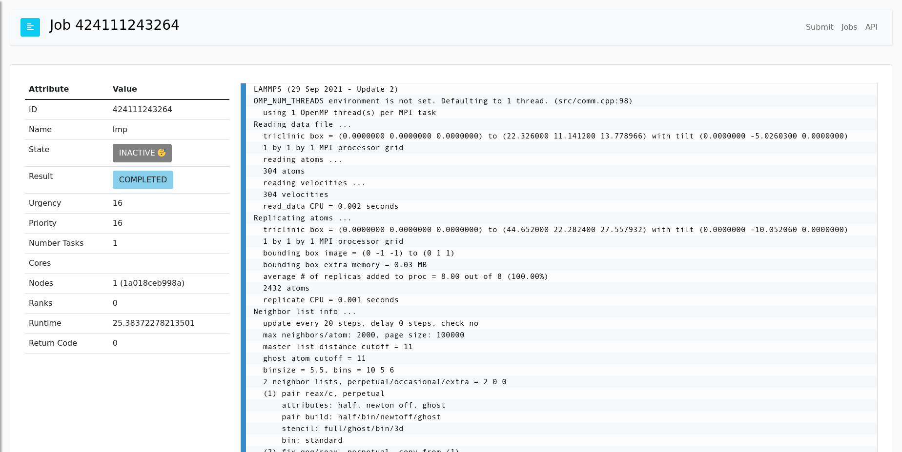

# Flux Lammps Example

This is an example container where you can build (optional) and run:

```bash
$ docker build --no-cache --build-arg app="ghcr.io/rse-ops/lammps:flux-sched-focal-v0.24.0" -t app-test .
$ docker run -it -p 5000:5000 app-test
```

And then enter the fluxuser and 123456 as the user and token, and try submitting a job to
the examples like:

```
# Potential command and workdir
#    command: lmp -v x 2 -v y 2 -v z 2 -in in.reaxc.hns -nocite
#    workdir: /home/flux/examples/reaxff/HNS
```



And then browse to the table and click on the ID to see the log.




You can also try using the [RESTFul API](https://flux-framework.org/flux-restful-api/getting_started/user-guide.html#getting-started-user-guide--page-root). Have fun!
