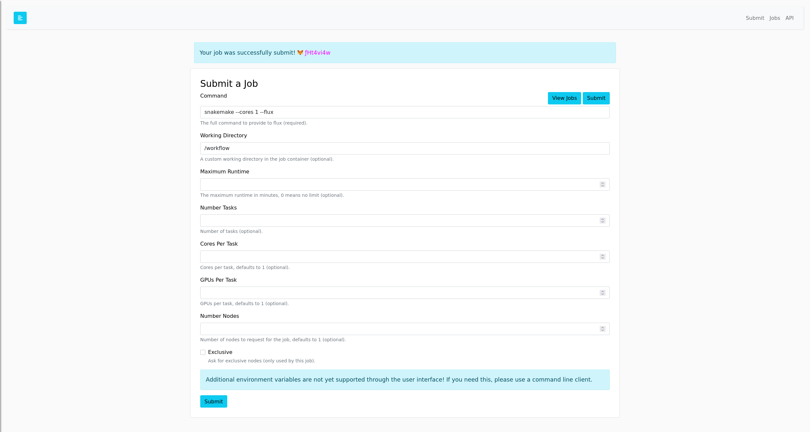
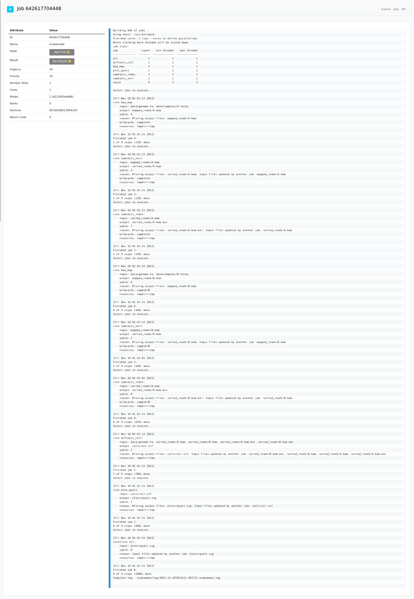

# Flux Snakemake Example

This is an example container where you can build (optional) and run
the [Snakemake tutorial workflow](https://snakemake.readthedocs.io/en/stable/tutorial/tutorial.html):

```bash
$ docker build -t snakemake .
```

## Running the Workflow

### RESTFul API and Interface

To use the Flux RESTFul API and interface:

```
$ docker run -it -p 5000:5000 snakemake
```

Requiring a Flux user/token (fluxuser and 12345)

```bash
$ docker run -it --env require_auth=true -p 5000:5000 snakemake
```

And then enter the fluxuser and 123456 as the user and token, and try submitting a job to
the examples like:

```console
# Potential command and workdir
# command: snakemake --cores 1 --flux --jobs 1
# workdir: /workflow
```



And then browse to the table and click on the ID to see the log.



You can also try using the [RESTFul API](https://flux-framework.org/flux-restful-api/getting_started/user-guide.html#getting-started-user-guide--page-root). Have fun!
